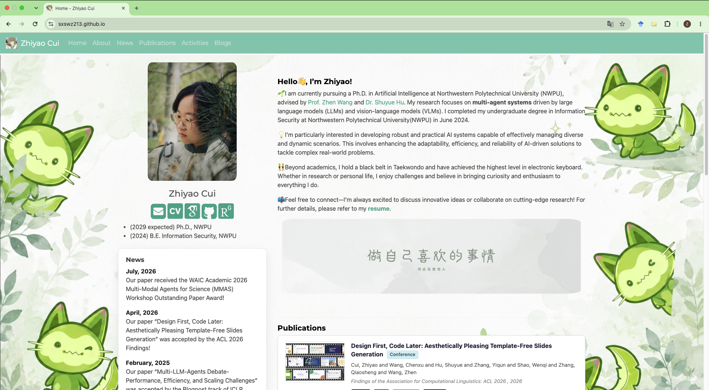

# ROCO Academic Homepage Template

一套带点“洛克王国”气质的 Jekyll 学术主页模板：清爽、可爱、适合展示论文、项目、博客、活动和个人资料。你可以把它当成自己的“学术小屋”——换上头像、填入论文、挂上项目徽章，再召唤一只绿色小伙伴当背景守护灵。



## 模板来源与致谢

本项目基于原 `Academic Homepage Template` 改造而来，保留 MIT License，并在此感谢原模板提供的 Jekyll 页面结构、数据组织方式和学术主页基础样式。

本仓库做了进一步整理与主题化：

- 将个人信息替换为可复用占位内容。
- 整理了中文使用说明。
- 加入洛克王国风格背景图 `images/image.png`。
- 保留适合学术主页的 publications、news、activities、blogs 等模块。

使用、修改或再发布时，请保留 `LICENSE` 文件，并在合适位置注明原模板来源。

## 这是什么

这是一个静态学术主页模板，适合：

- 研究者搭建个人主页。
- 学生展示论文、项目和简历。
- 实验室或小组快速搭建介绍页。
- 想给严肃学术内容加一点可爱滤镜的人。

如果传统 academic homepage 是冷冰冰的白纸黑字，那这个模板就是：论文照样放，项目照样列，但背景里会有一只精神状态稳定的小绿猫陪你营业。

## 功能特点

- Jekyll 静态网站，适合 GitHub Pages 部署。
- `_config.yml` 管理站点标题、导航栏、联系方式和页脚。
- `_data/*.yml` 管理新闻、成员、奖项、服务活动、资助信息等内容。
- `assets/ref.bib` + `jekyll-scholar` 管理论文列表。
- 支持博客、项目页面、团队页面、图片资源和论文 PDF。
- 已配置洛克王国主题背景：`images/image.png`。
- `Gemfile.lock` 已提交，方便别人 clone 后构建出更一致的页面。

## 本地召唤

首次 clone 后安装依赖：

```bash
bundle install
```

启动本地预览：

```bash
bundle exec jekyll serve
```

然后打开：

```text
http://127.0.0.1:4000/
```

如果只想构建静态文件：

```bash
bundle exec jekyll build
```

构建产物会生成到 `_site/`。这是炼金锅里产出的成品，不需要提交到 Git。

## 如何把它变成你的主页

建议按这个顺序改：

1. 改 `_config.yml`：站点标题、邮箱、机构、URL、导航栏和页脚信息。
2. 改 `_data/pi.yml`：个人简介、教育经历、主页链接、GitHub、Google Scholar、CV 路径等。
3. 换 `images/profile-placeholder.svg`：放你的头像、实验室 logo 或代表性图片。
4. 换 `images/image.png`：如果你有自己的洛克王国主题背景，可以直接替换这个文件。
5. 改 `assets/ref.bib`：用 BibTeX 添加论文。
6. 改 `_data/news.yml`、`_data/awards.yml`、`_data/academic_services.yml`：填新闻、奖项和服务活动。
7. 改 `_posts/`：写博客，或者删除示例文章。
8. 改 `_pages/`：调整 about、publications、services、blogs 等页面。

## 页面背景在哪里改

当前背景图配置在：

```text
_sass/SHB_css.scss
```

对应图片是：

```text
images/image.png
```

如果想换背景，最简单的方法是直接替换 `images/image.png`。如果想改展示方式，可以调整 `_sass/SHB_css.scss` 里的 `body` 背景样式。

## GitHub Pages 部署

部署前检查 `_config.yml`：

```yaml
baseurl: ""
url: "https://yourusername.github.io"
```

如果部署到用户主页仓库，例如：

```text
yourusername.github.io
```

通常 `baseurl` 保持为空。

如果部署到项目仓库，例如：

```text
roco_template
```

通常需要设置：

```yaml
baseurl: "/roco_template"
url: "https://yourusername.github.io"
```

仓库中包含 GitHub Actions 配置：

```text
.github/workflows/jekyll-deploy.yml
```

推送到 `main` 分支后，工作流会构建 Jekyll 网站并发布 `_site/`。

## Git 提交建议

建议提交这些文件：

- `Gemfile`
- `Gemfile.lock`
- `_config.yml`
- `_data/`
- `_pages/`
- `_layouts/`
- `_includes/`
- `_sass/`
- `assets/`
- `images/`
- `papers/`

不要提交这些本地生成物：

- `_site/`
- `.jekyll-cache/`
- `.sass-cache/`
- `vendor/`
- `node_modules/`
- `.bundle/`

## 发布前隐私检查

出发去王国广场前，记得检查背包里有没有不该公开的东西：

- 邮箱、电话、办公室地址和社交账号。
- CV、个人照片、头像和背景图。
- 未公开论文、草稿 PDF 或内部材料。
- Google Analytics、域名配置或部署 token。
- `_data/`、`_pages/`、`_posts/` 中的个人经历和项目描述。

## 许可证

本项目遵循 MIT License。详见 `LICENSE`。
